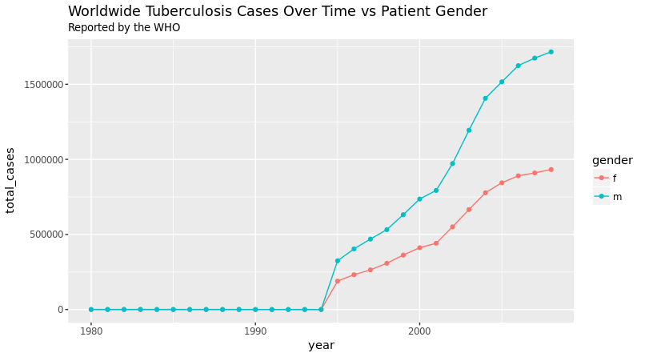
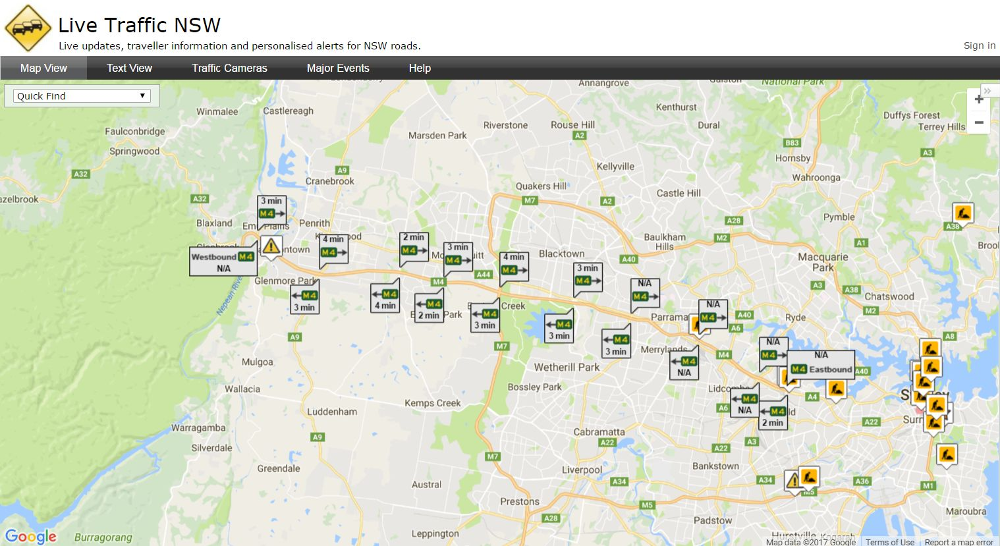

```{r setup, include=FALSE}
knitr::opts_chunk$set(echo = TRUE)
library(readr)
library(here)
library(knitr)
library(dplyr)
library(tidyr)
library(ggplot2)
```

# Introduction 
Tidy Data is the standard shape of data expected by major statistical modelling packages and frameoworks. This shape allows efficient applicaiton of split-apply-combine strategy for processing big data. This first exercise in the practical will give you hands on experience applying the principles of Tidy Data using tools from R's tidyverse (`dplyr` and `tidyr`).

The second exercise introduces feature engineering as an aspect of daa preprocessing. In the context of tidy data, feature engineering is the process of transforming columns of data to expose features of each observation to statistical modelling and machine learning algorithms. We'll use R to talk to Spark to some typical big data style processing. 

# Prerequisites
* The file `prerequisites.R` contains the installation code for the R packages needed to run this prac.
* The evironment you are running in will also need an installation of Java. See [How Do I Install Java?](https://java.com/en/download/help/download_options.xml) for more information.
* Finally Spark 1.6.3 will need to be installed in your environment. See: [http://spark.apache.org/downloads.html](http://spark.apache.org/downloads.html)

## Reading
* [Hadley Wickham's Tidy data paper](https://www.jstatsoft.org/article/view/v059i10)
* [Hadley Wickham's Split-Apply-Combine paper](https://www.jstatsoft.org/article/view/v040i01)
* [Data Wrangling Cheat Sheet](https://www.rstudio.com/wp-content/uploads/2015/02/data-wrangling-cheatsheet.pdf)

## 1. Tidying Data
This example is based on one from Hadley's [Tidy Data Vignette](ftp://cran.r-project.org/pub/R/web/packages/tidyr/vignettes/tidy-data.html). The table below is  an extract from a dataset that shows observations of Tuberculosis case instances by gender, age, country and year. The extract is of Australian cases.

**DiscussO*:

* How do the columns map to the information?
* What principles of Tidy data are violated?
* What would a Tidy version of this dataset look like?

### Data
```{r, message=FALSE}
tb_cases <- 
  read_csv(here("data","tb.csv"))

tb_cases %>% 
  filter(iso2 == "AU") %>%
  kable()  
```

### A Problem
Suppose that you were interested in plotting the cases by year and gender, irrespective of country and age. By paying special attention to the structure of the data frame it may be possible to code two nested loops that can create two new columns of Male and Female aggregate results. However, processing data a row at a time is usually not performant as the data structures are optimised to be processed a column at a time. So not only will this approach fail to scale to big data, It will require a significant custom code.

### A Solution

#### Gather the data 
A `gather` operation, sometimes referred to as `melt`, `unpivot`, or `stack` (depending on data processing framework) is the start of the solution to this problem. You can think of a `gather` as taking a group of columns and stacking their data on top of eachother one at a time. At the same time a new key column is created that keeps track of where the data originated.  

In the example below, the new key column is `group`, while the values were stacked into `num_cases`.

```{r, messges = FALSE}
tb_cases_gathered <-
  tb_cases %>%
  gather(key = "group", value = "num_cases", m04:fu)

tb_cases_gathered %>%
  filter(iso2 == "AU", !is.na(num_cases)) %>%
  top_n(10) %>%
  kable()
```

#### Seprate combined columns
The next issue is that age and gender are now combined in the group column, since we want to ignore the effect of age this will need to be resolved. Luckily we can use `dplyr::separate()` to solve this.

```{r}
tb_cases_sep <- 
  tb_cases_gathered %>%
  separate(col = group, into = c("gender", "age_group"), sep = 1)

tb_cases_sep %>%
  filter(iso2 == "AU", !is.na(num_cases)) %>%
  top_n(10) %>%
  kable()
  
plot_table <- tb_cases_sep %>%
  group_by(gender, year) %>%
  summarise(total_cases = sum(num_cases))

ggplot(plot_table, aes(x = year, y = total_cases, colour = gender)) +
  geom_path()
  
```

#### Exercise

* See if you can now summarise the data such that the observations are yearly totals for each each gender. Consult the Data Wrangling Cheatsheet linked above.
* Using the summarised data see if you can arrive at this plot using `ggplot2`:




**Discuss**:

* What elements of plotting did the tidy shape of the data make easier?
* Given what you know of linear modelling how does tidy data relate to the desired from of data for fitting linear models (e.g. by least squares)?


## 2. Feature Engineering

This example is based on historical travel time data from the M4 motorway in Sydney:


The motorway is broken up into a series of Eastbound and Westbound "routes" for which we have the recorded average transit time of vehicles calculated over consecutive 3 minute intervals from March to November in 2010.

### Initialisation
```{r, message = FALSE}
#initialise data file paths
m4_data_file <- here("data","m4_parquet")


#initialise spark

Sys.setenv(SPARK_HOME = file.path(Sys.getenv("HOME"),"spark-1.6.3-bin-hadoop2.6"))

#To install csv connecter, if required:
#system("$SPARK_HOME/bin/spark-shell --packages com.databricks:spark-csv_2.10:1.5.0")

library(SparkR, lib.loc = c(file.path(Sys.getenv("SPARK_HOME"), "R", "lib")))
sc <- sparkR.init(master = "local[*]", 
                  sparkEnvir = list(spark.driver.memory="2g"),
                  sparkPackages="com.databricks:spark-csv_2.10:1.5.0")
sqlContext <- sparkRSQL.init(sc)


#load data to spark instance from apache file format
m4_data <- read.parquet(sqlContext, m4_data_file)
```

### Data Exploration
The `route` column contains is the identifier of the stretch of road that the observed average transit time was made over. Westbound routes have IDs in 40010..400150 increasing East to West, while Eastbound routes have IDs in 41010..41160 increasing West to East.

`transit` contains the average transit time in deciseconds. The average is weighted in an unspecified manner.

`Date` is the time and date of the end of the 3 minute observation interval.

```{r, message = FALSE}
#show top 100 rows
showDF(m4_data, 10)  

#count number of rows
nrow(m4_data)

#The date range for our observations
showDF(
  select(m4_data, min(m4_data$Date), max(m4_data$Date))
)
```

**Discuss**: 

* is this Tidy Data?

### Feature Engineering and Preprocessing using Dplyr/Spark

#### Preprocessing
An issue we have to consider is that not all routes (sections of road) are the same length. We'll standardise the transit times. 

Standardising using Spark:
```{r, message = FALSE}
#Calculate the mean and sd for each route
summary_tab <- 
  summarize(group_by(m4_data, m4_data$route), mean = mean(m4_data$transit), sd = sd(m4_data$transit))
showDF(summary_tab)

#join the mean and sd back onto the main dataset
m4_data <- join(m4_data, summary_tab, m4_data$route == summary_tab$route, "left")

#Calculate a new column based in the Z-score
m4_data$std_transit <- (m4_data$transit - m4_data$mean)/m4_data$sd
showDF(m4_data, 10)
```

**Discuss**:

* How might you use `./data/RouteLengthApprox.csv` for alternate preprocessing preprocessing?


#### Feature engineering
The objective of feature engineering is to transform the data to present features that will offer traction to our chosen modelling approach. A common example is processing of timestamps. Here `date`, a timestamp with granularity in seconds will probably not be useful in detecting the signal associated with transit time. Common experience would tell us that the hour of the day and day of the week may be more useful covariates.

```{r, message = FALSE}
m4_data$day_of_week <- date_format(m4_data$Date, 'EEEE')
m4_data$hour_of_day <- hour(m4_data$Date)
showDF(m4_data, 10)
```

**Discuss**: 

* What other features might the transist time of a route be associated with?
* Can you conceive a way to engineer them in Spark? 

#Shutdown
That's the end of the practial. When you've finished experimenting, close your Spark session with:
```{r}
SparkR::sparkR.stop()
```

